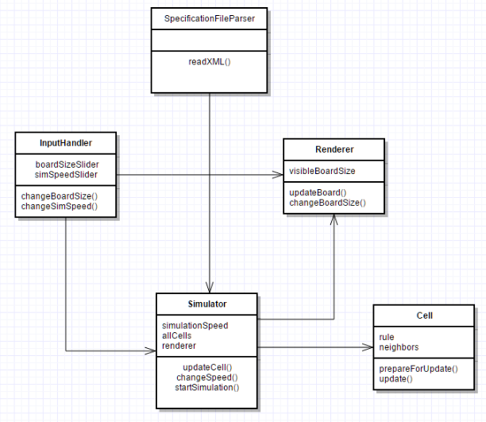

CompSci 308: Cell Society Design

### Introduction
In this project, we plan to build a program that can simulate a cellular automaton (CA) process. This program has a couple of components: 
- Specification File Reading: A specification file is an XML file that contains an initial configuration of the environment (i.e. which entry of a grid environment is occupied by what cell) and rules of the simulation (i.e. how a cell respond according to its neighbors), 
- Simulation Progression: There should be a class controlling the update of each cell in response to its neighbor at every time interval, 
- GUI Rendering: A GUI rendering class is responsible for drawing the current environment configuration onto screen, and
- Run-Time User Input: One or more classes are responsible for monitoring the simulation parameter change made by the user at run-time. These include changing board size, changing simulation speed, and changing board configuration using mouse or keyboard input. 

### Overview

There should be several essential classes. 
- SpecificationFileParser: This class is responsible for reading the input XML file to internal data structures. It should create two data structures: one for holding the rules of simulation and the other for holding the board configuration. 
- Cell: This class represents an individual cell. A cell is aware of its neighbors by storing an ArrayList of Cells. The cell also make decisions locally and independently. Since each decision is independent and simultaneous, the update method cannot be implemented atomically. Instead, it is broken down to two methods, prepareForUpdate(), which computes its next step value but do not modify its actual value, and update(), which substitutes its planned update value into its current value. 
- Simulator: This class is the main controller for the program. It stores the board configuration as an ArrayList of Cells. It is also responsible for autonomously updating the board by calling prepaeForUpdate() and update() function on each of the cells. It should also keep time by itself using TimerTask. 
- Renderer: This class is responsible for rendering to GUI. On initialization, it should receive parameters about the board (e.g. dimension of the board). It should provide public function of updateBoard(), which is called by Simulator at appropriate time to update cell appearance on the screen. 
- InputHandler: This class is responsible for handling user input at run time. Depending on functionality, this method may include methods such as (a). changeSimulationSpeed(), which changes speed of simulation; and (b). changeBoardSize(), which changes the size of the board. These methods should notify Simulator and Renderer to make appropriate change. 
A UML diagram is shown below: 

### User Interface

The UI will allow the User to interact with the simulation by changing the speed of the simulation, percentages of some parameters, and size of grid. The UI itself will just mainly appear to be a grid of cells with options to start, stop, and reset the simulation as well as change some parameters. 

### Design Details

The specification file parser is responsible for reading an input XML file. We should define tags for the input so that it is as flexible as possible. For rules, we should have different template for each rule type (“local” vs. “global”, deterministic vs. stochastic, as explained in Design Considerations Section). This rule format should accommodate easily the first two use cases. In addition, since the rule is loaded from XML, use case 4 is also covered by this class. 

The simulation of game logic (backend) is handled by the Simulator class, whose updateCell() calls prepareForUpdate() and update() on each cell in two passes. After the backend update, the updateCell() will also invoke updateBoard() in Renderer class to update the UI. This flow completes use case 3. 

The InputHandler design should have the functionality of switching to a different type of simulation. This is implemented by different “rule type”, and the core logic is thus handled by the spec file parser. The role of InputHandler is to respond to user’s request to read a new file and ask the Renderer to clear the current board on screen. 

### Design Considerations

We mainly discussed how to represent a rule. A rule can be “local” or “global”. A local rule means that each cell can make its own decision and covers most of the case. In a global rule however, a cell must communicate with nearby cells to make decision. For example, in segregation model, a movement of a cell is equivalent to two cells switching value, and thus is “global”. 

For local rules, without stochasticity, it can be exhaustively enumerated by a tabular function from current neighbor configuration to next state self configuration. With stochasticity, the function is replaced with a probability mass function. 

For global rules, a global controller seems necessary to control the simulation at a level higher than individual cell. We have not worked out exact details and decide to leave this part later to implement. 

In addition, we talked about how the board size change should work. We decide to make an underlying fixed-sized board (e.g. 1000x1000). Then board size change effectively changes the visible part of the board, rather than creating new board region or destroying existing board region. 

### Team Responsibilities

Yilun will be responsible for the specification parsing and cell creation. Andrew will be responsible for simulation logic. James will be responsible for UI design. A simple simulation program including no GUI design will be implemented to make sure that the game logic is right. Then a simple GUI will be implemented to finish core functionalities of the program. Finally, run-time user input will be added to finish the project. 

